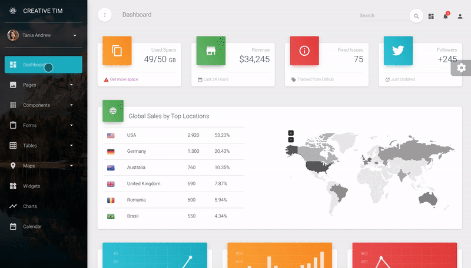

# Material Dashboard PRO React

Material Dashboard PRO React comes with 7 color filter choices for the links of the Sidebar (`blue`, `green`, `orange`, `red`, `purple`, `rose`, `white`), 3 filter color choices for background of the Sidebar (`white`, `blue`, `black`), an option to have a background image on the Sidebar and 6 color filter choices the card headers (`blue`, `green`, `orange`, `red`, `purple`, `rose`).

基于 [create-react-app](https://github.com/facebook/create-react-app) 构建，并使用 [Material-UI](https://github.com/mui-org/material-ui) 建造 UI 骨骼。

#### 特别致谢

- [Perfect-scrollbar](https://github.com/utatti/perfect-scrollbar) 美化滚动条
- [React-chartist](https://github.com/fraserxu/react-chartist) 可视化图表
- [React-datetime](https://github.com/YouCanBookMe/react-datetime) 日期选择器
- [React-big-calendar](https://github.com/intljusticemission/react-big-calendar) 日历选择器
- [React-bootstrap-sweetalert](https://github.com/djorg83/react-bootstrap-sweetalert) 警告弹窗
- [React-google-maps](https://github.com/tomchentw/react-google-maps) 地图
- [React-jvectormap](https://github.com/kadoshms/react-jvectormap) 矢量地图
- [React-nouislider](https://github.com/algolia/react-nouislider) 进度条
- [React-tables](https://react-table.js.org/#/story/simple-table) 图表
- [React-tagsinput](https://github.com/olahol/react-tagsinput) 标签
